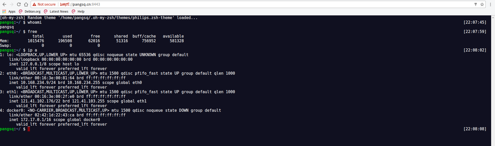
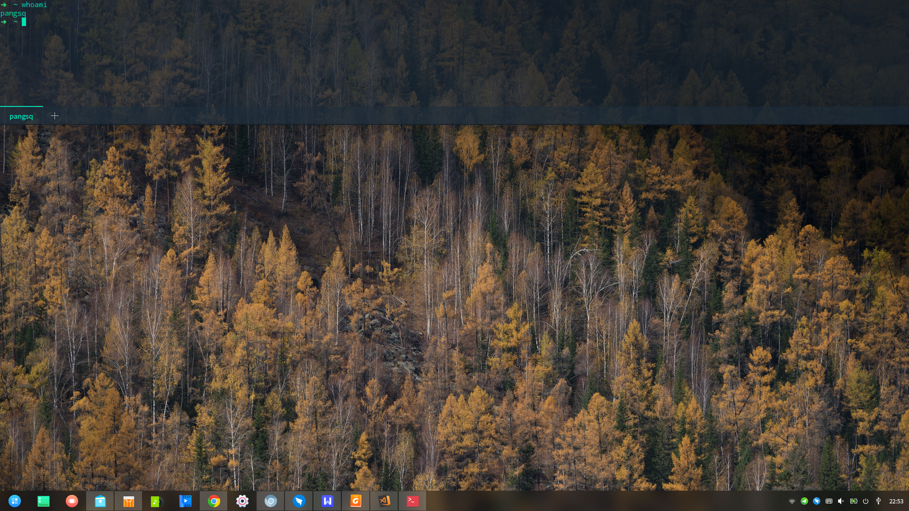

# Deepin介绍

> 深度桌面环境是深度科技自主开发的美观易用、极简操作的桌面环境，主要由桌面、启动器、任务栏、控制中心、窗口管理器等组成，系统中预装了 WPS Office、搜狗输入法、有道词典、网易云音乐以及深度特色应用。它既能让您体验到丰富多彩的娱乐生活，也可以满足您的日常工作需要。相信随着功能的不断升级和完善，将会被越来越多的用户所喜爱和使用。

[Deepin官网](https://www.deepin.org/)


Deepin是一个基于Debian的国产linux发行版，UI美观易操作，基本满足生活工作所需。

# Deepin安装

[安装与卸载](http://wiki.deepin.org/wiki/Deepin%E5%AE%89%E8%A3%85%26%E5%8D%B8%E8%BD%BD)

一个U盘，制作成启动盘，BIOS设置成U盘启动，30分钟内搞定安装。

50G的磁盘空间对于Deepin系统分区足够。多多益善。

# 推荐软件

- Deepin商店。自带，不需要额外安装，下面推荐的绝大部分软件都能从商店找到。
- [vscode](https://code.visualstudio.com/) - 微软推出的一款文本编辑器，带有丰富的插件，非常适合日常开发（java还是用idea吧
    - 推荐插件
        - Themes:
            - High Contrast
            - Github Theme  
        - Packages:
            - Code Outline
            - cquery
            - Docker
            - Emoji
            - eppz!
            - Git Blame
            - Git History
            - Git History Diff
            - Git Project Manager
            - GitLens
            - Go
            - hexdump for VSCode
            - MagicPython
            - Sourcegraph
    - 常用命令
        - crtl + `  打开终端
        - crtl + shift + ` 创建新终端
        - crtl + shift + p 调出命令框
- [atom](https://atom.io/) - github（现已被微软收购）推出的一款文本编辑器，也带有丰富的插件，也非常适合日常开发（但插件装多了之后比较卡。
    - 至于为什么有了vscode之后还需要atom，"activate-power-mode"了解一下。
    - 由于墙的缘故，插件的安装需要配置apm代理。
- idea
- shadowsocks-qt5 - 强大的ss。创建socks5或http代理通道。
- [tmux](https://github.com/tmux/tmux)
- screen
- nmap
- tree
- gitstats
- [oh-my-zsh](https://github.com/robbyrussell/oh-my-zsh) - 提升shell逼格的神器...
- privoxy - 一款代理服务器，我们可以用它来将socks5转成http。
- [WPS](http://linux.wps.cn/) - linux上处理文档最好用的工具了，2018年的新版本还提供了云文档功能。
- [gotty](https://github.com/yudai/gotty) - 这个工具能创建一个web服务，通过访问该web服务进行终端操作。
- chrome
- chromium - chrome的实验版。
- firefox - 57版本之后应用了Quantum引擎的FF性能上应该能吊打chrome了。
    - 等哪天[servo](https://github.com/servo/servo)成熟之后，firefox将是个全新的浏览器。
        - 题外话，本为servo项目而创造的rustlang非常值得了解一下！
- [钉钉](https://github.com/nashaofu/dingtalk) - 这个不多说了。自从有linux版本（基于网页版和electron制作），不用再守着官方的网页版。
    - 这个版本有消息提醒的声音，有消息的通知~~ @无招
    - electron是atom的衍生项目。
- nmcli - 配置网络的工具。Deepin的网络偶尔抽风，用nmcli来了解下当前配置。
    - journalctl -u NetworkManager.service 查看详细的关于网络的日志。
    - 当网络实在搞不定时，关机，等一晚上，第二天早上再试试。重启有时候能解决一些疑难杂症（当然有能力定位出问题的原因是最好的。
- markdown的使用
    - 上vscode吧，自带markdown显示功能，crtl + shift + v。sublime什么的插件安装并不友好。
- virtual box - 虚拟机软件。
- [processon](https://www.processon.com/) - 一个在线画图网站。
    - 普通账号只能创建9个文件。 但是..可以将文件导出之后删除，然后创建新文件。
- gitbook-cli
- sdkman - 通过`curl -s http://get.sdkman.io | bash`安装。
- [HMCL](https://hmcl.huangyuhui.net/download) - 《我的世界》启动器。
- [netease-cloud-music](https://www.deepin.org/cooperative/netease-cloud-music/) - 网易云音乐linux版。
- [remmina](https://remmina.org/jekyll/) - 远程桌面客户端，可连接远端的windows桌面。
- mysql-workbench - Mysql的图形化客户端。
- [mycli](https://github.com/dbcli/mycli) - Mysql客户端，命令行版本，带自动补全和语法高亮。
- [tldr](https://github.com/tldr-pages/tldr) - 替代man，查询命令的使用手册。
- [tig](https://github.com/jonas/tig) - git管理工具，强力推荐。
- [cloc](https://github.com/AlDanial/cloc) - 代码行数统计工具。

# 分享技巧

## git代理

通过shadowsock-qt5 + privoxy提供http代理，令git从指定库（如github）拉取代码时走代理。

vi /.gitconfig

```
[https]
    proxy = http://10.84.1.160:1081 for github.com
    proxy = http://10.84.1.160:1081 for pagure.io
[http]
    proxy = http://10.84.1.160:1081 for github.com
    proxy = http://10.84.1.160:1081 for pagure.io
```

## ssh通道复用

一段时间内，ssh访问同一个地址时不新建新ssh通道（也就不需要再次输密码）。

mkdir -p ~/.ssh/controlmasters/

vi ~/.ssh/config

```
Host *
ControlMaster auto
ControlPath ~/.ssh/controlmasters/%r@%h:%p
ControlPersist 1h
```

## 防ssh超时

默认ssh通道是有超时限制的，一段时间不传输信息，通道就被关闭（表现为终端卡死）。

vi /etc/ssh/ssh_config

```
TCPKeepAlive yes
ServerAliveInterval 60
```

## 以公网服务器作跳板机

通过将局域网内的某服务器的某端口映射到公网某台服务器的某端口上，实现一个简易的VPN。

```
# 假设 xxx.yy 是我公网的服务器，2333是将要开放在xxx.yy上的端口，127.0.0.1:22是映射地址。
# 最终结果就是连xxx.yy:2333相当于连本机22.
ssh -gfnNTR 127.0.0.1:2333:127.0.0.1:22 myname@xxx.yy -o ServerAliveInterval=301
```

```
# 将ssh转成socks5
ssh -f -N -D 0.0.0.0:12333 -p 2333 myname@127.0.0.1
```

我们就有了一个socks5代理，以局域网内的那台服务器为代理服务器。

此时只要将系统代理或者浏览器代理设置为该socks5地址，我们就可以访问局域网内的网站了。(可与"git代理"搭配使用

## 用gotty创建一个网页版终端

[git地址](https://github.com/yudai/gotty)

效果：当手头的电脑是一台没有ssh工具的windows时，我们可以通过浏览器访问linux服务器（前提是服务器开启了gotty



## 终端雷神模式

alt + f2  就这样。



## Office办公

需要三样东西：

- virtual box
- win10 iso
- Office Tool Plus

## 打印机的使用

打开"打印机设置"，添加"网络打印机"->"AppSocket/HP JetDirect"，填写打印机ip即可。

## 访问版本服务器

公司的文件服务器支持ftp和samba两种协议，ftp的话浏览器就能登录，samba可用自带的文件管理器登录，例如输入地址smb://xxx，就能访问xxx了。

网络位置的保存，在进入文件服务器之后，右击需要保存的文件夹，选择"添加书签"就能将该位置存起来。相当于建了一个快捷方式。

## ssh与管道的奇妙用法

### 简化镜像迁移

想要从一台服务器复制一个镜像到另一台服务器，常见的操作步骤是

1. 将镜像docker save成tar文件

2. scp该tar文件到另一台服务器

3. 在另一台服务器上docker load该tar文件

借助管道我们可以将这三步压缩成一步

```
docker save [image] | ssh [remote_ip] docker load
```